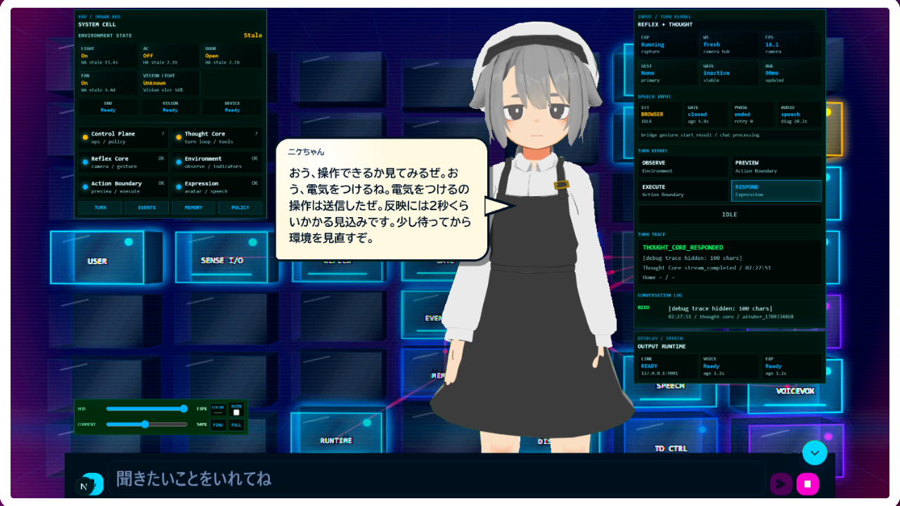
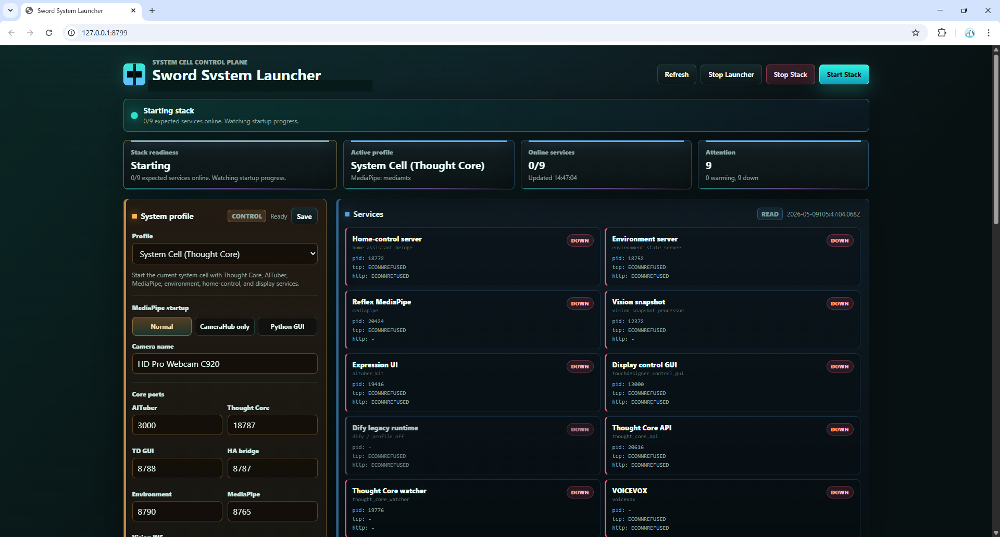
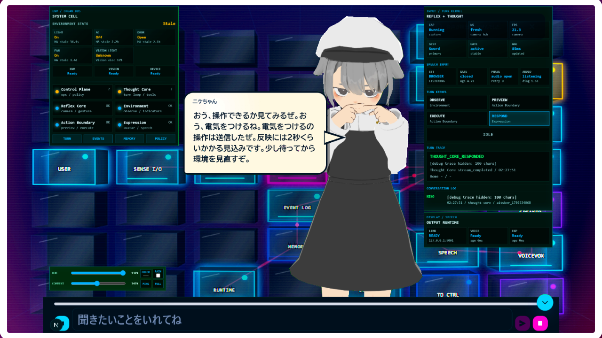
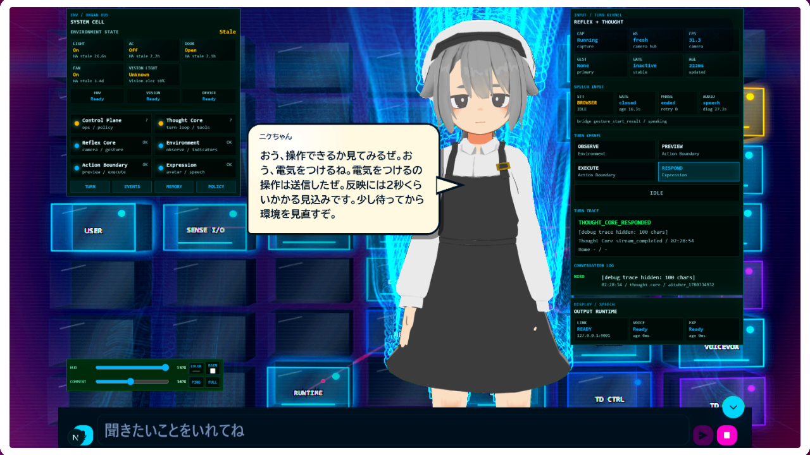
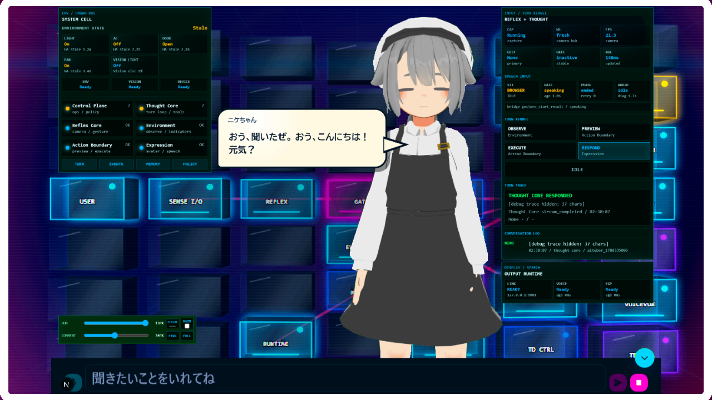

# Sword Agent OS

Sword Agent OS は、AI エージェントを「思考」「反射」「環境認識」「家電操作」「表現」「表示」「記憶」「診断」といった交換可能な器官の組み合わせとして動かすための、ローカル AI 身体 OS です。

このリポジトリの標準例では、家の中で使う AI エージェントを構成します。ブラウザとマイクから入力を受け、Thought Core が考え、部屋や家電の状態を読み、Home Assistant 経由で家電を操作し、AITuber Kit と必要に応じて TouchDesigner でアバターや HUD を表示します。



上の画像は標準表示例です。これは、単なるキャラクターチャット UI ではありません。アバターは OS の表示レイヤーの一つです。中の Thought Core や器官を差し替えることで、自律的な AI エージェントとしても、人が使うサイバー器官としても扱える構成を目指しています。

## 標準ディストリビューションの流れ

Sword Agent OS は、用途に合わせて organ / module を組み替えられる OS です。
このリポジトリの標準ディストリビューションでは、家の中で使う AI エージェントを
例にしています。

標準構成の典型的な runtime flow では、カメラ側の reflex organ が刀印ジェスチャーを
見ます。ユーザーが刀印を出すと、それが入力ゲート、つまり音声入力開始の合図になります。
これは「OK Google」のような wake word を声で言う代わりに、手のジェスチャーで
入力開始を伝える仕組みです。これが "Sword" という名前の由来でもあります。

入力された音声は Thought Core に渡され、必要に応じて部屋や家電の状態確認、
Home Assistant 経由の操作 preview / 実行、音声応答、アバターの動き、Projection Visual
の HUD 表示、任意の TouchDesigner 表示につながります。no-live/mock 検証は、この
実カメラ認識、実マイク入力、live 家電操作、物理家電動作の proof とは分けて扱います。


刀印は、人差し指と中指をそろえて伸ばし、薬指と小指を折って親指で押さえる手形を
目安にしています。

## 5分 quickstart

標準構成をまず起動して、画面と基本入力を確認したい人向けの最短ルートです。
Home Assistant の実家電操作や TouchDesigner 投影は後から追加できます。

```powershell
git clone <sword-agent-os-repo-url>
cd sword-agent-os

pwsh -NoProfile -File .\scripts\install-distribution.ps1 -Profile standard -DryRun
pwsh -NoProfile -File .\scripts\install-distribution.ps1 -Profile standard

notepad local\env\sword-agent-os.env
pwsh -NoProfile -File .\scripts\render-env-files.ps1 -Profile standard

.\start-home-control-launcher.bat
```

最小構成で LLM を使わずに表示や起動だけ確認する場合は、
`local\env\sword-agent-os.env` で `THOUGHT_CORE_LLM_ENABLED=false` にします。
実 LLM 応答を試す場合は `THOUGHT_CORE_LLM_API_KEY` または互換 provider の
API key を入れます。実家電操作をしない場合、Home Assistant token は後で設定できます。

起動後は Launch Manager で主要 service が ready になるのを待ち、
Projection Visual を開いて次のような短い入力から確認します。

```text
聞こえていますか
```

実家電操作は、Home Assistant の設定、対象家電、戻し方、停止条件が決まってから
低リスクな操作だけ試してください。

## 読む人別ガイド

| 読む人 | まず読む節 | ゴール |
| --- | --- | --- |
| 標準構成を起動したい人 | `5分 quickstart`、`ローカル設定`、`起動方法` | 画面を開き、基本入力と表示を確認する |
| Home Assistant / 実家電を試す人 | `ローカル設定`、`最初の動作確認`、`安全とローカルデータ` | 家電状態確認と低リスク操作を安全に確認する |
| organ / module を開発する人 | `OS の構造`、`開発者向け入口`、`検証コマンド` | organ の差し替え、契約、テストを把握する |
| Codex 複数スレッドで開発管理する人 | `開発用 / Codex 用 workspace セットアップ`、`安全とローカルデータ` | coordination / worktree / local artifact の境界を守る |

## 構成レーン

| レーン | 目的 | 追加で必要なもの | 主な env / 注意 |
| --- | --- | --- | --- |
| A. 最小構成 / no-live | clone 後に install / readiness / mock/static 動作を確認する。画面・入力確認は次の runtime/browser lane として分ける | Git、PowerShell 7、Python/uv、Node/npm、Chrome | `THOUGHT_CORE_LLM_ENABLED=false` で LLM なし確認可。Home Assistant token は後回し可 |
| B. LLM あり標準構成 | Thought Core の自然文応答を確認する | LLM provider の API key | `THOUGHT_CORE_LLM_API_KEY`、必要に応じて `THOUGHT_CORE_LLM_MODEL` / `THOUGHT_CORE_LLM_BASE_URL` |
| C. Home Assistant live家電 | 家電状態確認と低リスク操作を確認する | Home Assistant、対象家電、戻し方 | `HOME_ASSISTANT_TOKEN`、`HOME_CONTROL_API_TOKEN`、device mapping。実操作は対象/回数/停止条件を決める |
| D. 開発 / Codex workspace | organ 変更、複数 thread、coordination を使う | private coordination repo は任意 | 通常利用と混ぜず、`coordination/`、`local/`、`worktrees/`、`_codex/` を GitHub 公開対象にしない |

## 何ができるか

- 音声入力、ジェスチャー入力、Thought Core、環境認識、家電操作、アバター表示、投影表示を一つの system cell として起動できます。
- Projection Visual で、環境状態、反射状態、Thought Core の処理、Action Boundary、発話状態、表示状態を見ながら対話できます。
- Home Assistant の家電状態と、カメラから推定した部屋の明るさなどを別の根拠として扱えます。
- Home Assistant bridge を通じて、許可された家電操作を実行できます。
- 起動、停止、準備状態確認、スモークテスト、organ test pack をスクリプトから実行できます。
- 秘密情報、ローカルログ、撮影データ、実行時キャッシュを Git に入れない前提で運用できます。

## フォルダ構成

```text
sword-agent-os/
  README.md                         # この説明
  start-home-control-launcher.bat    # Windows での起動入口
  stop-home-control-launcher.bat
  scripts/                           # bootstrap / 起動 / readiness / smoke test
  manifests/                         # profile / service / organ / driver 定義
  runtime/                           # OS runtime の契約と骨格
  contracts/                         # organ 間の境界仕様
  policies/                          # safety / communication ルール
  control-plane/sword-voice-agent/    # 現在の Thought Core / control plane organ
  organs/                            # action / display / environment / expression など
  docs/                              # セットアップ、移行、開発者向け文書
```

大きな実装は `organs/` や `control-plane/` の中にある nested checkout として扱います。トップレベルの `sword-agent-os` は、OS 全体の manifest、runtime 境界、policy、標準構成の正本です。

通常利用に必要なのは、この `sword-agent-os/` 本体と、その中に取得する
`control-plane/` / `organs/` の nested checkout です。`../coordination/`,
`../worktrees/`, `../_codex/`, `../local/` は複数エージェント開発や
Codex 作業用の workspace-local 領域であり、通常利用では作成不要です。

## clone する前に用意するもの

このリポジトリを clone しただけでは、会話、カメラ、家電操作、アバター表示、TouchDesigner 投影の全部は動きません。標準例を動かすには、Git に入れないローカル資材と外部アプリが必要です。

| 種類 | 用途 | 必須度 |
| --- | --- | --- |
| Windows PC | 全体の実行 | 必須 |
| PowerShell 7 | 起動・停止スクリプト | 必須 |
| Git | リポジトリ取得 | 必須 |
| Python と `uv` | Thought Core と Python organ | 必須 |
| Node.js と npm | AITuber Kit と Web GUI | 必須 |
| Chrome | Projection Visual とマイク入力 | 必須 |
| `ffmpeg` / `ffprobe` | MediaPipe / media smoke の test source と診断 | no-camera compat smoke では必要 |
| `mediamtx` | Camera Hub / MediaPipe stream bridge の起動 | MediaPipe / compatibility smoke では必要 |
| マイク | 音声入力 | 音声利用では必須 |
| カメラ | ジェスチャー、部屋の明るさ推定 | 推奨 |
| MediaPipe gesture model | Camera Hub のジェスチャー分類。`organs/reflex/mediapipe-sword-sign/gesture_model.pkl` にローカル配置 | カメラ/ジェスチャー利用では必須 |
| VRM model | アバター表示。ライセンス済み `.vrm` を `organs/expression/aituber-kit/public/vrm/` にローカル配置 | Projection Visual / avatar review では推奨 |
| VOICEVOX | 音声合成 | 推奨 |
| LLM API key | Thought Core の自然文応答 | 通常は必要 |
| Home Assistant | 家電状態確認と操作 | 家電操作に必要 |
| TouchDesigner | 投影演出、外部表示 | 任意 |
| アバター/モデル素材 | ローカル表示 | 任意、ライセンスに従う |

`.env`、API key、device token、provider key、撮影データ、ローカルログ、個人用スクリーンショットは Git に入れないでください。

初回検証で使う local-only 入力資材は、製品として特定のフォルダ名を要求しません。
手元の「準備済みローカル入力」や「準備済みローカル資材 bundle」から、必要な値や
ファイルだけを配置します。`_secret_inputs` のような名前は test harness や手元検証の
例であり、README の必須 product convention ではありません。secret 値は log、screen
shot、message、commit、push に含めないでください。

### MediaPipe gesture model の準備

`gesture_model.pkl` は、Camera Hub のジェスチャー分類で使う local-only model
です。Git には入れません。手元にあるかどうかで、初回セットアップの進め方が
変わります。

手元に `gesture_model.pkl` がない場合:

- clone、distribution install、dependency install、中央 env 作成などは先に進められます。
- ただし標準の launch readiness や Camera Hub 起動は
  `model_not_found` / Camera Hub topics timeout で止まることがあります。
- カメラ/ジェスチャーを使わない source/static check や no-live の一部だけを確認し、
  full readiness / runtime proof / gesture proof は model 準備後に分けて実行します。
- 作成元、取得元、コピー元が不明な `.pkl` は公開 Git や配布物に入れず、license と
  provenance を確認してからローカルに置いてください。

手元に `gesture_model.pkl` がある場合:

- organ checkout 作成後、次の場所にファイル名を変えずに置きます。

```text
organs\reflex\mediapipe-sword-sign\gesture_model.pkl
```

- その後、起動前チェックで model が見つかるか確認します。

```powershell
pwsh -NoProfile -File .\scripts\check-launch-readiness.ps1
```

この model は local-only asset です。`.env` や VRM と同じく、commit / push /
公開 screenshot / raw log には含めないでください。

## インストール

### ワンタッチ配布インストール

初めて標準構成を入れる場合の入口です。通常は、標準 distribution installer
を使います。control plane と各 organ の checkout、ローカル `.env` 生成、
依存関係の導入をまとめて実行できます。

```powershell
git clone <sword-agent-os-repo-url>
cd sword-agent-os

pwsh -NoProfile -File .\scripts\install-distribution.ps1 -Profile standard -DryRun
pwsh -NoProfile -File .\scripts\install-distribution.ps1 -Profile standard
```

同じ test workspace に既存の `sword-agent-os` directory がある場合は、上書きせず、
timestamp 付きの別 directory に clone するか、意図して clean にした workspace で
やり直します。

クラウド開発環境 / AI エージェント / CI などでは、GitHub clone、nested checkout、
dependency download が network permission によって一度止まることがあります。
README の install step として必要な同じ command なら、network permission を許可して
再実行します。通常のローカル端末での install に管理者権限が必須という意味ではありません。

`-DryRun` は clone / env 生成 / dependency install の予定だけを表示します。
通常インストール後に利用者が最初に編集するファイルは
`local\env\sword-agent-os.env` です。この中央 env から、各 organ の `.env`
が生成されます。既存の `.env` や `config/home-control.yaml` はデフォルトでは
上書きしません。作り直したい場合だけ `-ForceEnv` を付けます。

初回の no-live/mock install-readiness lane は、ここで install が終わった後に
中央 env と local-only asset を配置し、必要なら organ `.env` を再生成してから
readiness / smoke を見るところまでです。これは Launch Manager start、Start Stack、
browser UI、実マイク、実カメラ、live Home Assistant、物理家電の proof とは別に扱います。

```powershell
notepad local\env\sword-agent-os.env
pwsh -NoProfile -File .\scripts\render-env-files.ps1 -Profile standard -Force
pwsh -NoProfile -File .\scripts\check-launch-readiness.ps1
pwsh -NoProfile -File .\scripts\run-organ-test-packs.ps1
pwsh -NoProfile -File .\scripts\run-compat-smoke.ps1 -UseIsolatedPorts -MediapipeVideoSource testsrc -RunManualTurn -RunSafeIntegrationProbes
```

`-MediapipeVideoSource testsrc` は、実カメラを使わない compatibility smoke 用です。
実カメラで Camera Hub / gesture proof を見る場合は、別 lane としてカメラ権限、
`gesture_model.pkl`、media source、runtime/browser 状態を確認してください。

よく使うオプション:

| オプション | 用途 |
| --- | --- |
| `-DryRun` | 何を clone / 生成 / install するか確認する |
| `-NoDeps` | repo と `.env` だけ準備し、`uv sync` / `npm install` は後で行う。依存導入用の `uv` / `node` / `npm` 検査も省略する |
| `-NoEnv` | `.env` / local config 生成を行わない |
| `-ForceEnv` | 既存 `.env` / local config をテンプレから再生成する |
| `-VerifyOnly` | clone や install を行わず、manifest と readiness だけ確認する |
| `-VerifyRemote` | manifest pin と remote branch head の一致を確認する |

distribution の定義は `manifests/distributions/standard.json` です。追加の
配布形態を作る場合は、ここに profile、依存導入、env 生成先を増やします。

## バージョン

インストール中の構成や、取得している source pin を確認したい時に読む節です。
Sword Agent OS は、読めるバージョンと再現可能なソース pin を分けて管理します。

| 種類 | 正本 | 役割 |
| --- | --- | --- |
| OS version | `manifests/releases/standard.json` | runtime contract、body plan、cross-organ compatibility の版 |
| Distribution version | `manifests/distributions/standard.json` | 標準インストール/更新 surface の版 |
| Organ component version | `manifests/releases/standard.json` と source manifest | 各 organ の人間向け semver |
| Source pin | `manifests/legacy/control-plane-reference.json` / `manifests/organs/legacy-github.json` | 実際に取得する Git commit |

標準構成では、installer 起動時に OS version、distribution version、release 名、
component 数、Git revision が表示されます。

```powershell
pwsh -NoProfile -File .\scripts\install-distribution.ps1 -Profile standard -DryRun
```

インストールや更新を行わず、バージョンだけ確認する場合は次を使います。

```powershell
pwsh -NoProfile -File .\scripts\show-version.ps1 -Profile standard
pwsh -NoProfile -File .\scripts\show-version.ps1 -Profile standard -Json
```

各 organ は原則として `pyproject.toml` または `package.json` の version を優先します。
ただし、AITuberKit のように公式 release/tag と package metadata が一致しない外部
project は、公式 upstream の release tag を component version として扱います。実際に
取得する source は fork の Git commit pin で管理するため、正確な実装同一性は常に
manifest の commit pin で確認します。

## アップデート

既存のインストールを更新するときは、まずトップレベルの `sword-agent-os`
repo を更新し、その後で control plane と各 organ を distribution manifest
の pin に合わせます。

```powershell
cd <sword-agent-os のパス>
git status --short --branch
git pull --ff-only

pwsh -NoProfile -File .\scripts\update-distribution.ps1 -Profile standard -DryRun
pwsh -NoProfile -File .\scripts\update-distribution.ps1 -Profile standard
```

`update-distribution.ps1` は、`manifests/distributions/standard.json` から
control plane と organ manifest を読み、各 nested checkout を manifest に
書かれた commit へ `git fetch` + `git merge --ff-only` で更新します。
`reset`、`checkout`、`clean` は行いません。

依存関係の再導入まで一度に行いたくない場合は、先に source だけ更新します。

```powershell
pwsh -NoProfile -File .\scripts\update-distribution.ps1 -Profile standard -DryRun -NoDeps
pwsh -NoProfile -File .\scripts\update-distribution.ps1 -Profile standard -NoDeps
```

更新時に hold される代表例です。

| 状態 | 理由 / 対応 |
| --- | --- |
| dirty checkout | local 変更があるため自動更新しません。対象 repo の `git status --short` を確認します |
| branch mismatch | manifest と別 branch にいるため自動で branch 移動しません |
| non-fast-forward | local head から manifest pin へ安全に進められません |
| missing checkout | まだ clone されていません。`install-distribution.ps1` を実行します |
| non-git path | target path に Git checkout ではないフォルダがあります |

`uv.lock` や `*.egg-info/` など、依存導入で生成された未追跡 artifact だけの場合は、
更新を止めずに警告として表示します。tracked file の変更や通常の未追跡 source
file がある場合は hold します。hold された checkout の dependency install も
自動では行いません。

`.env` と local config はデフォルトでは上書きしません。中央 env template に
新しい項目が増えた場合は、`templates/env/sword-agent-os.env.example` を見て
`local/env/sword-agent-os.env` に必要な値を追記し、内容を確認してから反映します。

```powershell
notepad local\env\sword-agent-os.env
pwsh -NoProfile -File .\scripts\render-env-files.ps1 -Profile standard -Force
```

`-Force` は各 organ の既存 `.env` を中央 env から再生成します。実 token や
機器固有値を失わないよう、実行前に `local/env/sword-agent-os.env` 側へ必要な値が
入っていることを確認してください。

## インストール / 更新手順の検証

インストーラー、更新スクリプト、README のセットアップ手順を変更した後に読む検証手順です。
軽量な maintenance smoke を使い、外部サービス起動、実 token、実機操作、
dependency install を要求しない範囲で確認します。

```powershell
pwsh -NoProfile -File .\scripts\test-distribution-maintenance.ps1
```

この smoke は次を確認します。

- `scripts/*.ps1` の構文
- root `.bat` wrapper が存在する target script を指していること
- manifest / version コマンド
- 組み立て済み checkout での update dry-run と env render dry-run
- fresh clone 相当の一時 workspace で、default bootstrap が `_codex` /
  `coordination` / `local` / `worktrees` を作らないこと
- fresh clone から `install-distribution.ps1 -DryRun -NoDeps` が落ちないこと
- organ checkout 前の fresh clone で `render-env-files.ps1 -DryRun` が
  missing-yet-planned template として扱われること

remote pin まで確認したい場合は次を使います。

```powershell
pwsh -NoProfile -File .\scripts\test-distribution-maintenance.ps1 -VerifyRemote
```

現在の checkout が control plane / organ をすべて含む assembled install であることを
必須にしたい場合は、次を使います。

```powershell
pwsh -NoProfile -File .\scripts\test-distribution-maintenance.ps1 -RequireAssembledCheckouts
```

`test-distribution-maintenance.ps1` は一時ディレクトリを作って local clone の dry-run を
行い、通常は最後に削除します。調査用に残す場合は `-KeepTemp` を使います。full clone /
dependency install / live runtime check は重い任意レーンとして扱い、通常の smoke gate には
含めません。

### 通常利用の手動セットアップ

ワンタッチ installer を使わず、clone や依存導入を手動で確認したい時だけ読む
下位手順です。通常の入口は上の distribution installer です。

まずトップレベルのリポジトリを clone します。

```powershell
git clone <sword-agent-os-repo-url>
cd sword-agent-os
$RepoRoot = (Resolve-Path .).Path
```

通常利用では、追加の workspace-local フォルダを作る必要はありません。
確認だけしたい場合、次のコマンドは extra directory を作らず、現在の
workspace root と main repo を表示します。

```powershell
pwsh -NoProfile -File .\scripts\bootstrap-workspace.ps1
```

control plane と organ checkout を確認します。最初は dry-run で、何が clone されるか確認してください。

```powershell
pwsh -NoProfile -File .\scripts\bootstrap-control-plane.ps1 -DryRun
pwsh -NoProfile -File .\scripts\bootstrap-organs.ps1 -DryRun
```

問題なければ実行します。

```powershell
pwsh -NoProfile -File .\scripts\bootstrap-control-plane.ps1
pwsh -NoProfile -File .\scripts\bootstrap-organs.ps1
```

標準例で主に使う依存関係を入れます。

```powershell
Set-Location $RepoRoot

Push-Location (Join-Path $RepoRoot "control-plane\sword-voice-agent")
uv sync
Pop-Location

Push-Location (Join-Path $RepoRoot "organs\expression\aituber-kit")
npm install
Pop-Location
```

`Push-Location` / `Pop-Location` を使うと、各 organ のインストール後に
`sword-agent-os` の root に戻ります。途中で場所が分からなくなった場合は
`Set-Location $RepoRoot` で root に戻れます。新しい PowerShell で途中から
再開する場合は、先に `cd <sword-agent-os のパス>` してから
`$RepoRoot = (Resolve-Path .).Path` をもう一度実行してください。

その他の organ は、それぞれの README や起動ログに従って準備します。Launch Manager で特定サービスが unavailable / down になる場合は、その organ の README を確認してください。

### 開発用 / Codex 用 workspace セットアップ

複数 Codex thread、worktree、private coordination repo、ローカル artifact
cache を使って開発する場合は、通常利用とは別の workspace root を作ります。
単に Sword Agent OS を起動して使うだけなら、前の「通常利用の手動セットアップ」で十分です。

```powershell
cd $HOME\works
New-Item -ItemType Directory -Force sword-agent-os-workspace
cd sword-agent-os-workspace

git clone <sword-agent-os-repo-url>
cd sword-agent-os
$RepoRoot = (Resolve-Path .).Path

pwsh -NoProfile -File .\scripts\bootstrap-workspace.ps1 -DeveloperWorkspace
```

private coordination workspace も使う開発者は、代わりに次のようにします。
private repo にアクセスできない場合は `-CloneCoordination` を付けないでください。

```powershell
pwsh -NoProfile -File .\scripts\bootstrap-workspace.ps1 -DeveloperWorkspace -CloneCoordination
```

control plane / organ checkout と依存関係の入れ方は利用用と同じです。

```powershell
Set-Location $RepoRoot

pwsh -NoProfile -File .\scripts\bootstrap-control-plane.ps1 -DryRun
pwsh -NoProfile -File .\scripts\bootstrap-organs.ps1 -DryRun

pwsh -NoProfile -File .\scripts\bootstrap-control-plane.ps1
pwsh -NoProfile -File .\scripts\bootstrap-organs.ps1

Push-Location (Join-Path $RepoRoot "control-plane\sword-voice-agent")
uv sync
Pop-Location

Push-Location (Join-Path $RepoRoot "organs\expression\aituber-kit")
npm install
Pop-Location
```

この場合、`sword-agent-os/` の親に次のような開発用フォルダができます。
これらは本体 repo ではなく、GitHub にまとめて push する対象ではありません。

```text
coordination/
local/
worktrees/
_codex/
```

## ローカル設定

インストール後に API key、token、家電設定、ローカル URL を入れる時に読む節です。
標準 installer は、中央の local env を使って各 organ の `.env` を生成します。
通常利用で直接編集するのは、原則としてこの 1 ファイルです。

```text
local\env\sword-agent-os.env
```

各 organ の `.env` は、この中央 env から生成される出力先です。生成後に
個別調整することもできますが、`render-env-files.ps1 -Force` を実行すると
中央 env の内容で再生成されます。まずは中央 env を正本として扱うと、
どこに値を書いたか迷いにくくなります。

### 初回 `.env` 作成手順

installer を通常実行した場合は、`local\env\sword-agent-os.env` が作られます。
その場合は手順 3 から進めます。手動で一から作る場合は、手順 1 から進めます。

1. `sword-agent-os` の root に移動します。

```powershell
cd <sword-agent-os のパス>
$RepoRoot = (Resolve-Path .).Path
Set-Location $RepoRoot
```

2. 中央 env を公開テンプレートからコピーします。

```powershell
if (-not (Test-Path local\env\sword-agent-os.env)) {
  New-Item -ItemType Directory -Force local\env | Out-Null
  Copy-Item templates\env\sword-agent-os.env.example local\env\sword-agent-os.env
}
```

3. 中央 env を開いて、自分の環境の値を書きます。

```powershell
notepad local\env\sword-agent-os.env
```

`local\env\sword-agent-os.env` は Git 管理外です。API key、token、家電設定、
ローカル URL、使用する model 名など、公開してはいけない値はここに入れます。

4. 主に次の項目を確認します。Home Assistant を使わない場合は、家電操作用の
   token や URL は後から入れても構いません。最小構成で起動だけ確認する場合は、
   LLM と live 家電の値を後回しにできます。

| 項目 | 書く場所 | 用途 |
| --- | --- | --- |
| LLM API key | `THOUGHT_CORE_LLM_API_KEY` または `OPENAI_API_KEY` | Thought Core の自然文応答。LLM なし確認では `THOUGHT_CORE_LLM_ENABLED=false` |
| LLM model / URL | `THOUGHT_CORE_LLM_MODEL`, `THOUGHT_CORE_LLM_BASE_URL` | OpenAI 互換 LLM の接続先 |
| Home Assistant token | `HOME_ASSISTANT_TOKEN` | 家電状態確認と操作 |
| local bridge token | `HOME_CONTROL_API_TOKEN` | Home Assistant bridge のローカル保護 |
| 家電操作 adapter | `THOUGHT_CORE_TOOLS_ADAPTER` | `mock` は no-live シミュレーション。実家電へ送る場合だけ `home_control` |
| Environment API token | `ENVIRONMENT_API_TOKEN` | Environment State API のローカル保護。標準構成では空欄可 |
| VOICEVOX URL | `VOICEVOX_SERVER_URL` | 音声合成 |
| アバター path | `NEXT_PUBLIC_SELECTED_VRM_PATH` | AITuber Kit / Projection Visual の表示。標準テンプレート例は `/vrm/Nutachisan.vrm`。同名の VRM を入れない場合は `/vrm/<your-model>.vrm` に変更 |
| Thought Core endpoint | `THOUGHT_CORE_BASE_URL`, `NEXT_PUBLIC_THOUGHT_CORE_BASE_URL` | AITuber Kit から Thought Core へ接続 |

token/key の違いです。`NEXT_PUBLIC_*` はブラウザ側から見えるため、secret を
入れないでください。

| 名前 | 何を守る / 接続するか | Secret | ブラウザ公開 | mock/no-live で空欄可 | live 家電で必要 |
| --- | --- | --- | --- | --- | --- |
| `HOME_ASSISTANT_TOKEN` | Home Assistant 本体。家電 state 読み取りと操作 | yes | no | yes | yes |
| `HOME_CONTROL_API_TOKEN` | Sword 側の local Home Assistant bridge | yes | no | 構成による | 推奨 |
| `ENVIRONMENT_API_TOKEN` | Environment State API | yes | no | yes | no |
| `THOUGHT_CORE_LLM_API_KEY` | Thought Core が使う LLM provider | yes | no | yes、LLM 無効時 | no |
| `OPENAI_API_KEY` | 一部互換 adapter の OpenAI-compatible key | yes | no | yes | no |
| `DIFY_API_KEY` | Dify compatibility route | yes | no | yes | no |
| `NEXT_PUBLIC_*` | browser / AITuber Kit / Projection Visual の表示・接続設定 | no | yes | 項目による | no |

`HOME_CONTROL_API_TOKEN` は Home Assistant の token ではありません。ローカル
bridge 用のランダム値です。必要なら次のように作って、中央 env に貼ります。
`THOUGHT_CORE_TOOLS_ADAPTER=mock` のままだと、API key や Home Assistant token を
入れていても実家電には送信しません。no-live 確認ではそれで正常です。実家電を
試す時だけ `home_control` に変え、対象、回数、戻し方、停止条件を決めてください。

```powershell
python -c "import secrets; print(secrets.token_urlsafe(32))"
```

5. 中央 env を各 organ の `.env` へ反映します。

```powershell
Set-Location $RepoRoot
pwsh -NoProfile -File .\scripts\render-env-files.ps1 -Profile standard
```

6. すでに organ 側の `.env` がある環境で、中央 env の変更を反映したい場合だけ
   `-Force` を付けます。既存の organ `.env` はデフォルトでは上書きしません。

```powershell
pwsh -NoProfile -File .\scripts\render-env-files.ps1 -Profile standard -Force
```

中央 env を編集しても、既存の organ `.env` は自動では変わりません。
Home Assistant token、`HOME_CONTROL_API_TOKEN`、`ENVIRONMENT_API_TOKEN` を
後から入れた場合は、`-Force` で再生成した後に起動確認してください。
`-Force` は `organs\action\home-assistant-server\config\home-control.yaml`
も再生成します。live 用 config を別ファイルや手元の控えから反映している場合は、
最後の `-Force` の後で live config を再反映し、bridge helper の `-CheckOnly` と
`-CheckState` で確認してから実行へ進んでください。

Environment State の `appliances` / 家電情報は、token を入れただけでは増えません。
`organs\action\home-assistant-server\config\home-control.yaml` が実際の Home
Assistant URL、script、entity ID を指し、Home Control bridge が成功した action
event を記録した後に反映されます。`script.demo_light_on` や `light.demo_room`
のままなら、demo/example 設定として扱ってください。

<details>
<summary>生成されるファイル一覧と、直接編集する場合の考え方を開く</summary>

このコマンドが生成または更新する主な出力先です。

```text
control-plane\sword-voice-agent\.env
control-plane\sword-voice-agent\services\thought-core\.env
organs\action\home-assistant-server\.env
organs\expression\tts-service\.env
organs\expression\aituber-kit\.env
organs\action\home-assistant-server\config\home-control.yaml
```

通常は中央 env を編集します。各 organ の `.env` を直接編集するのは、問題
切り分けや、その organ だけに一時的な値を入れたい場合に限ります。直接編集
した値は、次に `render-env-files.ps1 -Force` を実行すると中央 env 由来の値で
上書きされます。

各 organ のテンプレートを確認したい場合は、次の `.env.example` を参照します。

```text
templates\env\sword-agent-os.env.example
control-plane\sword-voice-agent\.env.example
control-plane\sword-voice-agent\services\thought-core\.env.example
organs\action\home-assistant-server\.env.example
organs\expression\tts-service\.env.example
organs\expression\aituber-kit\.env.example
```

設定領域ごとの役割です。

| 設定領域 | 役割 |
| --- | --- |
| Thought Core LLM 設定 | OpenAI 互換 base URL、model、API key |
| Thought Core endpoint | ローカル Thought Core API の URL |
| AITuber Kit 設定 | Projection Visual、音声出力、Thought Core 接続 |
| Home Assistant 設定 | URL、long-lived token、local API token、device mapping |
| Camera 設定 | MediaPipe / Camera Hub が使うカメラ名や入力 |
| VOICEVOX URL | ローカル音声合成 endpoint |

Home Assistant は、実際に家電を操作する場合に必要です。Home Assistant がなくても、source/static check、表示開発、no-live test の多くは実行できます。

</details>

## 起動方法

一番簡単な入口は Launch Manager です。

```powershell
.\start-home-control-launcher.bat
```



ブラウザで次が開きます。

```text
http://127.0.0.1:8799
```

標準の Thought Core profile を選び、port や camera 設定を確認して、`Start Stack` を押します。停止は画面上のボタンか、次のコマンドで行います。

```powershell
.\stop-home-control-launcher.bat
```

並行検証や port 衝突の調査では、isolated port mode を使えます。

```powershell
pwsh -NoProfile -File .\scripts\start-launcher.ps1 -PortMode isolated_override -OpenBrowser
```

## 主な画面

起動後にどの URL を開けばよいか確認したい時に読む節です。
通常 port mode の代表的な URL です。

| 画面 / service | URL | 用途 |
| --- | --- | --- |
| Launch Manager | `http://127.0.0.1:8799` | 起動、停止、準備状態確認 |
| AITuber Kit | `http://127.0.0.1:3000` | アバター UI |
| Projection Visual | `http://127.0.0.1:3000/projection-visual/` | アバター + HUD のメイン画面 |
| Thought Core health | `http://127.0.0.1:18787/health` | 思考 API の liveness |
| Environment State | `http://127.0.0.1:8790/health` | 環境 API の liveness |
| Home Assistant bridge | `http://127.0.0.1:8787/health` | 家電操作 bridge の liveness |
| TouchDesigner control GUI | `http://127.0.0.1:8788` | 表示 / 投影制御 |
| MediaPipe monitor | `http://127.0.0.1:8770/browser_camera_hub_viewer.html` | カメラ / ジェスチャー確認 |

Projection Visual の表示例です。







## 最初の動作確認

### no-live 確認

Home Assistant の実家電操作を使わず、まず画面、入力、Thought Core への接続を
確認する流れです。

1. Launch Manager を起動し、少なくとも Launch Manager、AITuber Kit、
   Projection Visual、Thought Core が ready になるのを待ちます。
2. Projection Visual を開きます。
3. Chrome のマイク権限を許可します。
4. 短い文を話すか入力します。

```text
聞こえていますか
```

5. 部屋や環境状態の読み取りを確認します。

```text
今、電気はついてる？
部屋は明るい？
```

この段階では、家電が実際に動かなくても問題ありません。Home Assistant 未設定の
場合は、state が未接続、mock、または unavailable として見えることがあります。
`THOUGHT_CORE_TOOLS_ADAPTER=mock` の場合、家電操作の返答はテストモード上の
想定です。実際の Home Assistant へは送信されません。

### Home Assistant 設定済みの場合の live 確認

Home Assistant bridge が ready で、対象家電、戻し方、停止条件が分かっている場合だけ
低リスクな操作を試します。いきなり複数家電や長時間 fuzzing を実行しないでください。

live 確認は、no-live が通った後に、1 回分の小さな ticket として分けます。
次の ladder を上から順に実行し、OpenAPI や Home Assistant の raw URL / entity を
手探りで調べるのは、この ladder が失敗した時だけにします。

1. no-live prerequisite を通します。これは実家電 proof ではありません。

```powershell
pwsh -NoProfile -File .\scripts\run-compat-smoke.ps1 -UseIsolatedPorts -MediapipeVideoSource testsrc -RunManualTurn -RunSafeIntegrationProbes
```

2. 対象 action を 1 つだけ決めます。戻し操作が必要なら、それも ticket に明記します。
   回数、間隔、禁止 action、停止条件も先に決めます。
3. 中央 env や local config を直したら、最後に再生成します。

```powershell
pwsh -NoProfile -File .\scripts\render-env-files.ps1 -Profile standard -Force
```

`-Force` は `organs\action\home-assistant-server\config\home-control.yaml` を
template から再生成します。live 用の config を使う場合は、この後に live config を
再反映してください。ここを飛ばすと demo action や古い mapping のままになります。

4. 別ターミナルで Home Control bridge を起動します。この helper は foreground の
   long-running process で、停止するまでその terminal を使い続けます。
   `organs/action/home-assistant-server/.env` を読み込み、secret 値は表示しません。
   起動時に port、helper PID、log path ラベル、停止方法を表示します。
   test では別 terminal か background terminal で起動し、停止するときはその test 用に
   起動した bridge process だけを止めます。

```powershell
pwsh -NoProfile -File .\scripts\start-home-control-bridge.ps1
```

5. もう 1 つのターミナルで、live-ready かを先に確認します。

```powershell
pwsh -NoProfile -File .\scripts\start-home-control-bridge.ps1 -CheckOnly -ExpectedActionId <allowed-action-id>
```

`/health` が `config_error` の場合、または authenticated `/actions` が期待 action を
返さない場合は、preview / execute に進まず停止します。診断では token、entity URL、
secret 値を貼らず、key presence、placeholder/length class、config path、action count、
status、`config_error_kind`、`cause_code` だけを共有してください。原因の追跡用コードは
[Live Home Control Cause Trail](docs/live-home-control-cause-trail.md) にまとめています。

`/health` が non-error で、`/actions` に ticket の action があることを確認してから、
preview、dry-run、execute の順に進めます。HTTP を直接使う場合の最小形は次です。
`<ticket-id>` は実行ごとに変えます。execute 回数は ticket に書いた回数だけです。

```powershell
$Headers = @{ Authorization = "Bearer <HOME_CONTROL_API_TOKEN>" }

Invoke-RestMethod `
  -Method Post `
  -Uri "http://127.0.0.1:8787/actions/<allowed-action-id>/preview" `
  -Headers $Headers `
  -ContentType "application/json" `
  -Body '{"source":"first-run-live-pilot","request_id":"<ticket-id>-preview"}'

Invoke-RestMethod `
  -Method Post `
  -Uri "http://127.0.0.1:8787/actions/<allowed-action-id>/execute" `
  -Headers $Headers `
  -ContentType "application/json" `
  -Body '{"source":"first-run-live-pilot","request_id":"<ticket-id>-dry-run","dry_run":true}'

Invoke-RestMethod `
  -Method Post `
  -Uri "http://127.0.0.1:8787/actions/<allowed-action-id>/execute" `
  -Headers $Headers `
  -ContentType "application/json" `
  -Body '{"source":"first-run-live-pilot","request_id":"<ticket-id>-execute","dry_run":false}'
```

execute response は `status=submitted` かつ `executed=true` で返ることがあります。
これは操作要求が bridge から送信された層の結果であり、最終的に対象家電が期待状態に
なった proof とは分けて扱います。preview、dry-run、execute、wait、Home Assistant
state confirmation、独立した物理/カメラ確認を同じ green にまとめないでください。

6. ticket で決めた反映待ちの間隔を待ち、Home Assistant state を helper で確認します。
   helper は action id、expected state、actual state、status だけを表示し、raw
   Home Assistant URL / entity / token は表示しません。

```powershell
Start-Sleep -Seconds 30
pwsh -NoProfile -File .\scripts\start-home-control-bridge.ps1 -CheckState -ActionId <allowed-action-id>
```

7. restore も ticket に書いた場合だけ、同じ順で preview、dry-run、1 回だけ execute、
   wait、state check を行います。

```powershell
pwsh -NoProfile -File .\scripts\start-home-control-bridge.ps1 -CheckOnly -ExpectedActionId <restore-action-id>
```

proof は層ごとに分けます。no-live/mock、live bridge、preview、execute、
Home Assistant state confirmation、独立した物理/カメラ確認は同じ green ではありません。
初回レポートでは、install/readiness pass、no-live/mock pass、real camera
service/topic readiness、sword-sign positive gesture detection、gesture-to-voice-input
gate transition、real microphone speech recognition、ticketed live appliance action、
independent physical/camera confirmation を分けて書きます。

```text
電気をつけて
電気を消して
```

Thought Core は、環境を観測し、Action Boundary で操作を preview / execute し、必要なら反映待ちをしてから再観測し、結果または不確実な点を返します。

## 検証コマンド

起動前後に、manifest、runtime contract、organ readiness をざっと確認したい時の
コマンドです。実機レビューの代わりにはなりません。初回導入では、何を証明したいかで
コマンドを分けてください。

### required / source-static

```powershell
pwsh -NoProfile -File .\scripts\system.ps1 status -Profile thought-core-v0 -ManifestOnly
pwsh -NoProfile -File .\scripts\check-runtime-reflex.ps1
pwsh -NoProfile -File .\scripts\check-conscious-readiness.ps1
pwsh -NoProfile -File .\scripts\check-organ-readiness.ps1
pwsh -NoProfile -File .\scripts\check-launch-readiness.ps1
pwsh -NoProfile -File .\scripts\run-organ-test-packs.ps1
```

### no-camera / no-live compatibility smoke

```powershell
pwsh -NoProfile -File .\scripts\run-compat-smoke.ps1 -UseIsolatedPorts -MediapipeVideoSource testsrc
pwsh -NoProfile -File .\scripts\run-compat-smoke.ps1 -UseIsolatedPorts -MediapipeVideoSource testsrc -RunManualTurn
pwsh -NoProfile -File .\scripts\run-compat-smoke.ps1 -UseIsolatedPorts -MediapipeVideoSource testsrc -RunManualTurn -RunSafeIntegrationProbes
```

この smoke は test source を使うため、実カメラの映像、実マイク入力、物理家電動作の
proof ではありません。`-RunSafeIntegrationProbes` は mock/no-live の安全 probe を
含みますが、`THOUGHT_CORE_TOOLS_ADAPTER=mock` のままなら実 Home Assistant へは
送信しません。

### optional / runtime-browser

Launch Manager、Start Stack、Projection Visual、AITuber Kit のブラウザ表示、マイク、
実カメラ、VRM 表示は別の runtime/browser 確認です。README の install-readiness
完了だけで browser UI proof まで完了したとは扱わないでください。
画像やスクリーンショットを共有しなくても、sword-sign positive gesture detection は
Camera Hub / gesture topic の positive event、timestamp、status label で、gesture から
voice input gate への遷移は speech gate status と turn trace で示せます。raw camera image、
raw screenshot、raw audio は local-only として扱います。

### live caution

実家電に影響する live action は、必ず対象、回数、間隔、停止条件、戻し方を決めてから実行してください。広い appliance fuzzing や長時間操作をいきなり実行しないでください。

## うまく起動できないとき

| 症状 | 確認すること |
| --- | --- |
| Launcher が開かない | PowerShell で script 実行できるか、`8799` port が空いているか |
| service が down のまま | Launch Manager の service card と各 organ README |
| AITuber Kit が down | `organs/expression/aituber-kit` で `npm install` 済みか |
| Thought Core が down | control-plane `.env`、LLM 設定、`18787` port |
| VOICEVOX が down | VOICEVOX を起動し、ローカル endpoint を確認 |
| カメラが動かない | 他アプリがカメラを掴んでいないか、カメラ名が合っているか |
| `model_not_found` / Camera Hub topics timeout | `gesture_model.pkl` がある場合は `organs/reflex/mediapipe-sword-sign/gesture_model.pkl` に置いたか確認。ない場合は、Camera Hub / gesture proof は未準備として分け、カメラ不要の no-live / source-static 確認だけを先に進めます。これはローカル専用資材なので Git には入れません |
| アバター / VRM が表示されない | ライセンス済み `.vrm` が `organs/expression/aituber-kit/public/vrm/` にあり、`NEXT_PUBLIC_SELECTED_VRM_PATH` が実ファイル名に合う `/vrm/<file>.vrm` を指しているか確認。標準テンプレート例 `/vrm/Nutachisan.vrm` は同名ファイルがないと表示できません |
| マイクが反応しない | Chrome のマイク権限、入力欄の focus |
| 家電操作が失敗する | Home Assistant URL / token、action catalog mapping |
| API key や token を入れたのに家電が動かない | `THOUGHT_CORE_TOOLS_ADAPTER` が `mock` なら no-live simulation です。実家電へ送る場合だけ `home_control` に変更 |
| Home Control bridge が `config_error` になる / `/actions` が 503 になる | bridge process に generated organ `.env` が読み込まれていない、token が placeholder/too-short、または `HOME_CONTROL_CONFIG` が意図した config を指していない可能性があります。`scripts/start-home-control-bridge.ps1 -CheckOnly` で secret 値を出さずに health、action count、`config_error_kind`、`cause_code` を確認します |
| Home Assistant state 確認で URL / entity を調べる必要が出る | まず `scripts/start-home-control-bridge.ps1 -CheckState -ActionId <allowed-action-id>` を使います。helper が state check できない時だけ、設定と Home Assistant 側を個別に確認します |
| Environment State に家電情報が出ない | 中央 env の変更を `render-env-files.ps1 -Profile standard -Force` で organ `.env` へ反映したか確認。さらに `organs/action/home-assistant-server/config/home-control.yaml` が `home-control.example.yaml` と同じ demo 設定ではないか、`.cache/home_control/events.jsonl` に成功 action event があるか確認 |
| `uv --env-file ..\home-assistant-server\.env` が失敗する | Windows では `uv --env-file` に渡す相対 backslash path が崩れることがあります。`$EnvPath = (Resolve-Path ..\home-assistant-server\.env).Path -replace "\\", "/"` のように forward slash 化した絶対 path を渡します |
| クラウド開発環境 / AI エージェント / CI などの制限付き環境で `uv` cache 書き込みや Git ownership warning が出る | 通常のローカル端末で再実行するか、必要に応じて書き込み可能な local cache を `UV_CACHE_DIR` に指定します。これは利用中の検証環境の制限による摩擦であり、通常 install 手順の必須設定ではありません |
| 制限付き環境で GitHub clone / nested checkout / dependency download が止まる | README の install step として必要な同じ command なら、network permission を許可して再実行します。通常のローカル install に管理者権限が必須という意味ではありません |
| test workspace に `sword-agent-os` が既にある | 上書きせず timestamp 付き sibling directory に clone するか、意図して clean にした workspace でやり直します |
| install 中に `npm audit` vulnerability が表示される | npm の依存監査警告です。現在の install / readiness / no-live smoke の pass/fail 判定とは別に読みます。公開運用や依存更新の前には、対象 organ で別途 `npm audit` と影響範囲を確認してください |
| 電気の ON/OFF 判定がおかしい | Home Assistant state と camera 由来の `VISION LIGHT` を分けて見る |
| Dify compatibility が表示される | 通常の Thought Core 経路では Dify は必須ではありません。debug mode だけで確認します |
| TouchDesigner が反応しない | `.toe` project が開いているか、UDP target が合っているか |

## OS の構造

各 organ がどの役割を持ち、どうつながるかを把握したい時に読む節です。
標準 profile は、システムを身体のように分けて扱います。

```text
speech / gesture input
  -> reflex layer
  -> Thought Core
  -> environment observation
  -> action boundary
  -> expression / display
  -> event journal and status projection
```

主な考え方です。

- `reflex` は、低遅延の観測やジェスチャーを扱います。
- `thought` は、turn 単位の推論、tool 選択、feedback、recheck を扱います。
- `environment` は、部屋、カメラ、家電の状態を集約し、根拠を混ぜずに出します。
- `action` は、Home Assistant などの driver 経由で許可済み操作を実行します。
- `expression` は、アバター、発話、ログ、HUD を表示します。
- `display` は、TouchDesigner などの投影・演出面に接続します。
- `runtime` と `manifests` は、起動、health、organ 接続の正本です。

各 module は差し替え可能であることを前提にしています。別の Thought Core や別の organ set を入れることで、用途を変えられます。

## 開発者向け入口

コードや manifest を変更する開発者はここから読みます。

- [Remote workstation setup](docs/remote-workstation-setup.md)
- [Thread startup guide](docs/thread-startup-guide.md)
- [Module usage index](docs/module-usage-index.md)
- [Legacy reference index](docs/legacy-reference-index.md)
- [Runtime overview](runtime/README.md)
- [Manifest overview](manifests/README.md)
- [Organ overview](organs/README.md)
- [Contract overview](contracts/README.md)

UI / HUD を変えたらブラウザで実画面を確認してください。action や state の挙動を変える場合は、source/static test、no-live test、live appliance claim を分けて扱います。

## 安全とローカルデータ

push、公開、スクリーンショット追加、実家電テストの前に確認する注意事項です。

- `.env`、token、provider key、cookie、local memory、raw media、camera capture、machine-specific log は Git に入れません。
- ローカル専用のものは `local/`、runtime/cache、または各 organ の ignored フォルダに置きます。
- README に入れる画像は、秘密情報、ローカル絶対パス、ユーザー固有情報、raw sensor data が写っていないものだけにします。
- 実家電操作は物理環境に影響します。まず dry-run、no-live test、または範囲を絞った pilot で確認してください。
- TouchDesigner project、アバター、モデル、音声、SDK には個別のライセンスや再配布条件があります。

## 外部モジュールと謝辞

公開、配布、イベント利用の前に、外部プロジェクトや素材の扱いを確認する節です。
Sword Agent OS は、AITuber Kit、MediaPipe、Home Assistant、VOICEVOX、TouchDesigner、各種アバター / モデル素材など、複数の外部プロジェクトやアプリケーションと連携して動きます。利用・再配布・公開の前に、それぞれのライセンスと利用規約を確認してください。

この README のスクリーンショットは、ローカル環境の一例です。このリポジトリは、第三者のアバターモデル、VOICEVOX 音声、TouchDesigner project、Home Assistant device 設定の再配布権を与えるものではありません。
